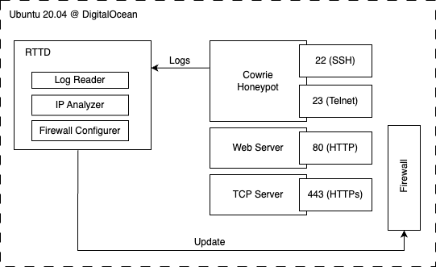

# Final Computer Security Project
Reykjavik University, T-742-CSDA Computer Security (Spring 2023). 

# Components
This repo contains the code implementation of the final project.

## Architecture 
The architecture is set up as shown in the image. 

The repository consists of the following components:

## Honeypot (port 22)
A Cowrie honeypot that monitors live attacks and produces logs. The honeypot is the most important information source of our RTTD. The logs of the honeypot are used to investigate the attackers and their behaviour. Moreover, the logs are used by the RTTD system to dynamically configure the firewall to secure the system.

## Application server (port 80)
A simple flask server which stores information about all incoming connections. All connection events are logged. 

## TCP server (port 443)
A simple TCP server. This server waits for incoming connections and logs the IP address along with the received data. The server does not respond to incoming connections. In contrast to the web server running on port 80, this server logs all connections attempts on TCP level instead of only logging successful HTTP requests.

## RTTD 
A python script which parses the honeypot logs and configures the firewall of the operating system accordingly.

The script consists of three main parts, run based on certain conditions, which can be seen below.
- At a honeypot log file modification: Firewall Rule Additions (`on_modified(self, event)`). After a rule addition, before a log event, the IP analyser is also run.
- Every 5 minutes: IP cache updates (`update_cached_rules()`)
- Every 10 minutes: Firewall Rule Deletions (`cleanup()`)
Addition and deletions are saved to a specific log file. The cleanup and updating of cache is printed to the command line.

### IP analyzer
Analyses an IP after it has been added to the firewall. The checks of the IP analyser is explained below, under the title **Profiling attacking IPs: "Who is attacking?"**

## Analysis
The analysis folder contains files that were used to anyalse the logs and create charts for the final report. *These files were altered continuosly and are therefore not exhaustive in functions used to aggregate data and generate charts. But they may be inspected to gain insight into our workflow.*

# Research Questions
Our project focused on answering three main questions listed below. The data gathered during the experiments are gathered in productive_logs, divided by two phases.

**Phase 1:**
- Honeypot at 22
- Application server at 80
- TCP server at 443

**Phase 2:** 
- Honeypot at 22
- Application server at 80
- TCP server at 443
- **RTTD system & firewall activated**

## Profiling attacking IPs: "Who is attacking?"
- Passive checks:
    - blocklists? (https://github.com/firehol/blocklist-ipsets)
    - known TOR exit node? (https://www.dan.me.uk/tornodes) -> Umm... You can only fetch the data every 30 minutes - sorry.  It's pointless any faster as I only update every 30 minutes anyway.
If you keep trying to download this list too often, you may get blocked from accessing it completely.
(this is due to some people trying to download this list every minute!)
    - known VPN/Proxy server? (https://iphub.info/api)
    - Reverse DNS lookup?
    - geolocation (https://ip-api.com/)
- Active checks:
    - which ports are open?
        - default scan 

## Analyzing data: "What does the attacker do?"
- Honeypot at 22:
  - used passwords
  - executed commands (tty)
  - investigate downloaded files
- Webserver at 80:
  - called paths
  - credentials?
  - form/json data
- TCP server at 443:
  - what data is sent to the tcp socket?

## Using honeypot data to secure network: "How to prevent attacks?"
- User honeypot logs to configure firewall
  - protect ports 80 and 443
  - as fast as possible
  - delete rules if IP is not active anymore
  - whitelist our IPs

